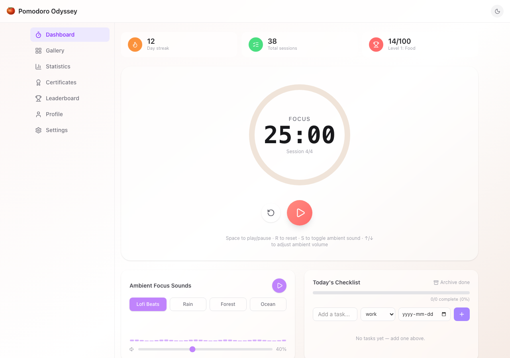
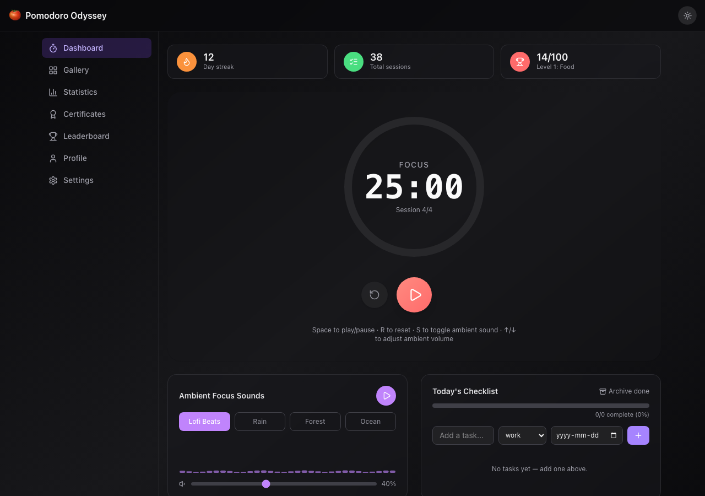
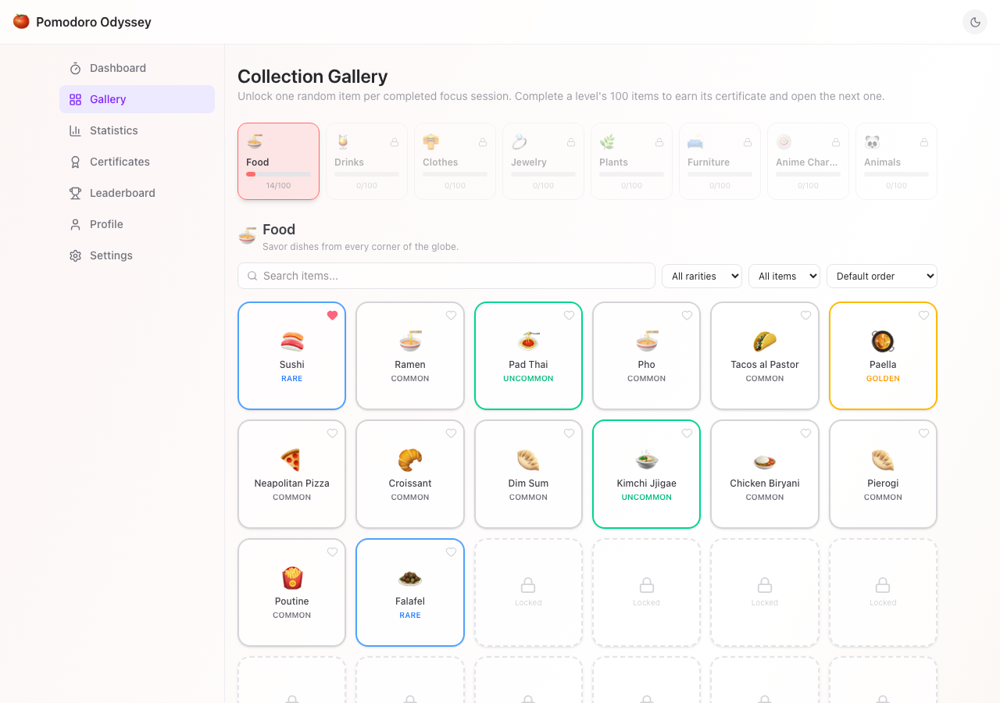
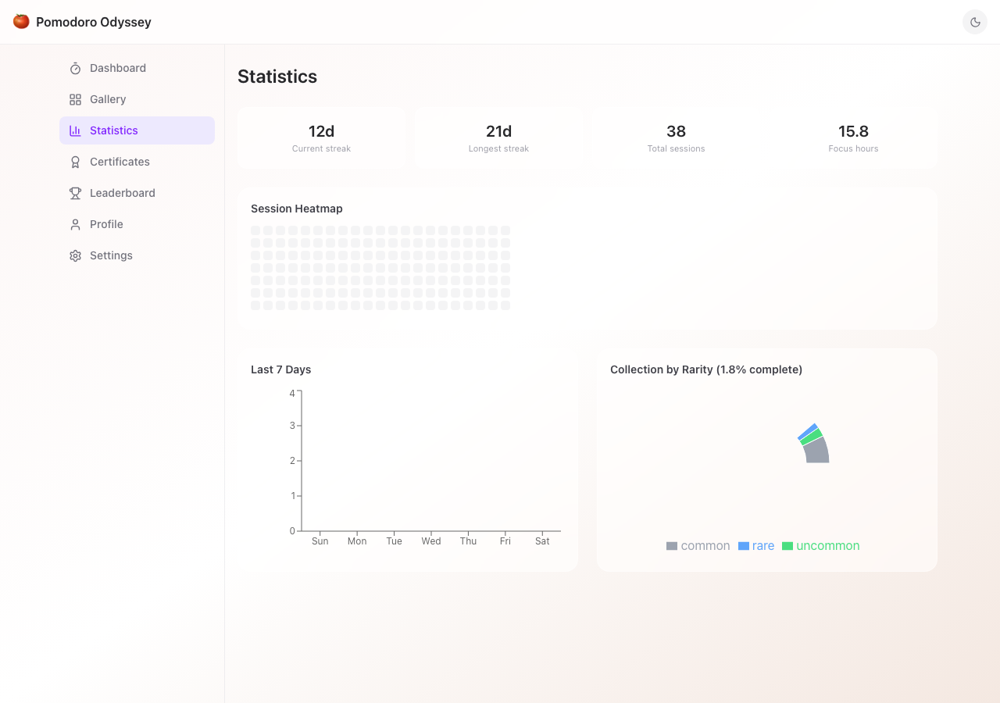

# 🍅 Pomodoro Odyssey

A gamified Pomodoro timer. Every completed focus session unlocks a random
item from an 800-piece collection spanning 8 categories — food, drinks,
clothes, jewelry, plants, furniture, anime characters, and animals — each
with real, accurate details, not filler text. Built as a full local-first
web app: timer, ambient sound synthesis, task management, statistics,
and PDF certificates all work fully offline against the browser.



<details>
<summary>More screenshots (dark mode, gallery, statistics, certificate)</summary>
<br>

| | |
|---|---|
|  |  |
|  |  |

</details>

## Features

**Focus timer** — circular SVG progress ring, customizable work/break
durations, keyboard shortcuts (`Space` play/pause, `R` reset, `S` toggle
ambient sound, `↑`/`↓` volume), daily streak and session tracking.

**Ambient sound** — four soundscapes (lofi, rain, forest, ocean), fully
synthesized in-browser with the Web Audio API (no audio files to fetch),
with a live canvas frequency visualizer and independent volume control.

**Collection system** — 800 items across 8 levels, unlocked one at a time
on session completion via a mystery-box reveal animation with confetti.
Rarity tiers (common/uncommon/rare/golden) with duplicate protection,
favoriting, search/filter/sort, and per-item detail pages with real
category-specific metadata (recipes and cuisines for food, care
instructions and pet-toxicity for plants, gemstone/material for jewelry,
habitat/conservation status for animals, and more).

**Tasks** — daily checklist with drag-to-reorder, priority starring,
categories, optional due dates, and an archive of completed tasks.

**Certificates** — auto-generated on completing a full 100-item level,
with a QR code, downloadable as a real PDF.

**Statistics** — session heatmap, weekly activity chart, and a rarity
breakdown of your collection.

**Accounts, sync, sharing, AI art generation** — implemented as mock
services with the same request/response shapes a real backend would use
(see [What's real vs. mocked](#whats-real-vs-mocked) below).

## Tech stack

React 18 · TypeScript · Vite · Tailwind CSS v4 · Zustand (localStorage
persistence) · React Router · Framer Motion · dnd-kit · Recharts ·
canvas-confetti · html2canvas-pro + jsPDF

## Getting started

```bash
npm install
npm run dev        # start the dev server
npm run build      # type-check + production build
npm run lint        # oxlint
```

## Project structure

```
src/
  components/   UI components, grouped by feature (timer, sound, tasks, collection, layout, shared)
  pages/        Route-level pages (Dashboard, Gallery, Statistics, Certificates, Profile, Settings, Leaderboard)
  store/        Zustand stores (timer, tasks, collection, settings, auth, sync, session history)
  services/     Mock backend services (auth, AI image generation, sharing, data export)
  data/         Generated item catalog + level config + "this day in history" facts
  scripts/      One-off generator that produces the 800-item catalog
  lib/          Web Audio synthesis, small pure helpers
  hooks/        useTimerEngine (the Pomodoro state machine), useTheme
  types/        Shared TypeScript types
```

## What's real vs. mocked

Everything under **Timer, Ambient Sounds, Tasks, Collection/Gallery,
Statistics, Certificates, Settings** is fully functional against browser
`localStorage` — no backend required.

The product spec this app was built from also describes a full backend
(Postgres, Redis, S3, real OAuth, AI image generation, WebSocket sync,
leaderboards, a React Native app). Building that requires infrastructure
and credentials this environment doesn't have, so those pieces are
implemented as **mock services with the same request/response shapes**
described in the spec, so they're a near drop-in swap for real endpoints
later:

- `src/services/mockAuthApi.ts` — register/login/Google/magic-link,
  backed by a fake "accounts table" in localStorage. The full flow works
  (register → login → session → logout), but no identity is actually
  verified against anything, and nothing is shared across devices.
- `src/services/aiImageService.ts` — `generateItemImage`,
  `getGenerationStatus`, `batchGenerateImages`, `regenerateItem`, matching
  the documented endpoint contracts (currently returns placeholder emoji
  illustrations instead of AI-generated art).
- `src/store/syncStore.ts` — simulated cloud sync status/progress; there's
  no server to sync with yet.
- `src/services/shareService.ts` — uses the real Web Share API / clipboard
  where possible; social "share to X/Discord/etc." links point at intent
  URLs but there's no public profile page to point them at yet.
- Certificates embed a real QR code and generate a real downloadable PDF,
  but the QR code points at a verification endpoint that doesn't exist.
- Leaderboard page mixes your real local stats with seeded fake peers.

Not built: the React Native mobile app, real OAuth/2FA, WebSocket
real-time sync, admin dashboards, and community/marketplace features.

## Known issues

- **Ambient sounds / chime are silent in Safari when running the local dev
  server (`http://localhost`).** Confirmed via a minimal, app-independent
  test snippet (bare `new AudioContext()` + oscillator, created directly
  inside a real click handler) that Safari itself keeps the `AudioContext`
  `suspended` and produces no sound on this origin, even with the
  Settings → Websites → Auto-Play permission set to allow. Chrome and
  Firefox both play audio correctly — this is a Safari + local-dev-origin
  interaction, not a bug in the app's audio code. Untried follow-ups if
  this needs to work in Safari later: test over HTTPS (e.g. via `vite
  --https` or a tunnel) instead of plain `http://localhost`, or test in a
  Safari Private Browsing window / via `127.0.0.1` instead of `localhost`.

## Data

The 800 collection items are generated once by
`src/scripts/generate-items.mjs` into `src/data/items.json` /
`levels.json` — curated real-world names per category, each mapped to
accurate details (cuisine, origin, care instructions, gemstone, etc.) via
name-based lookup tables rather than randomly assigned, with a seeded
deterministic rarity distribution (~55% common / 30% uncommon / 14% rare /
1% golden). Re-run it with `node src/scripts/generate-items.mjs` if you
tweak the source lists — it validates its own lookup-table coverage and
warns about any item names it can't find accurate data for.
